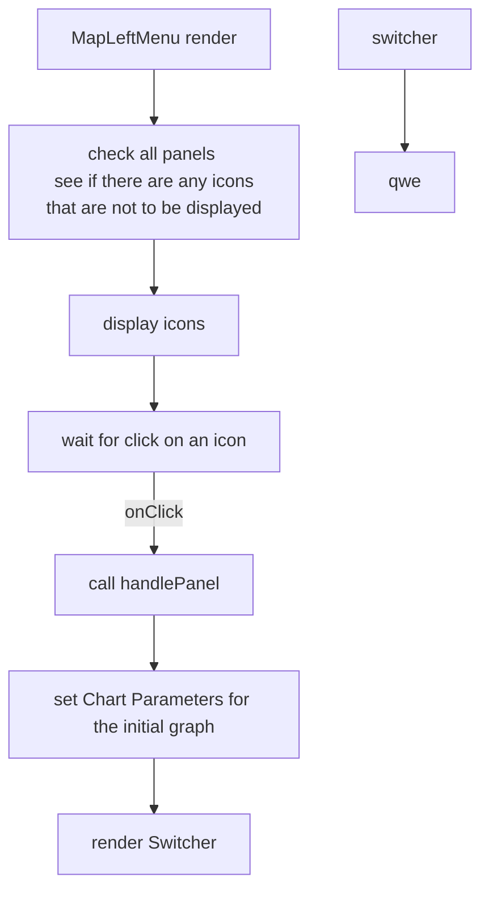

```mermaid
graph TD
    A[MapLeftMenu render ] --> B[check all panels \n see if there are any icons that are not to be displayed]
    B --> C[display icons ]
    C --> D[wait for click on an icon]
    D-- onClick--> D1[call handlePanel]-->D2[set Chart Parameters for the initial graph]
D2-->E[render Switcher]

E1[switcher]--> E2[qwe]


```
