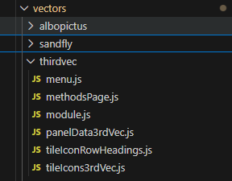
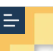
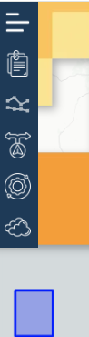
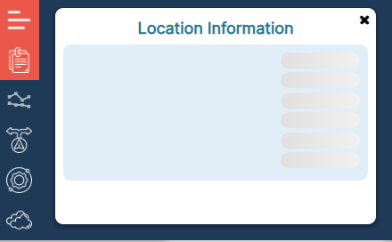
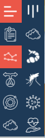
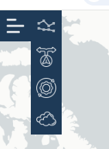
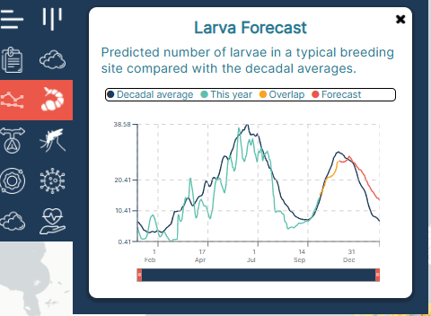

# How to Add a New Vector

## Overview

This guide will walk you through the process of adding a new vector to the veclim portal.

## The file system

The script looks for all files named `module.js` in the subfolders of the folder `src/vectors`.

The user can create a directory in vectors and add the following files.



In this case we have simply copied and paster the sandfly folder, and changed names accordingly. the script will find the `module.js` and register the vector according to a system.

### The Module file

an example module file:

```js
const moduleObj = {
  // this is the name of the vector we will be adding to our system
  id: 'albopictus',
  meta: {
    // in the vector selsction menu the icon and description we will be using is defined here.
    icon: tileIconMoz,
    description: (
      <p>
        The model of the Asian tiger mosquito (<i>Ae. albopictus</i>) and
        disease (CHIKV/DENV/ZIKV) transmission
      </p>
    ),
    // default route for this vector  IT will open when /MapPAge is written
    route: '/MapPage',
    // When we want to use session and tiles  `session`
    session: 'albopictus',
    methods: {
      route: '/Methods/albopictus',
      label: 'Tiger Mosquito',
    },
  },
  //  The custom methods page for the vector. If there is no custom method, we can copy an existing one on it.
  methodsPage,

  // which tiles will be shown.
  tileIcons,
  // panels and menu items are defined here
  panelData,
  // the menu items are declared here
  menu: ALB_MENU,
  // tile row headings when looking at the tile selection panel
  tileIconRowHeadings,
  // default Bounds.
  map: {
    defaultBounds: 'world',
    // when switching to this vector from another one, you can set bounds here
    // default is when switching from papatasi to albopictus, the bounds stay over cyprus
    switchBounds: 'cyprus',
    defaultCenter: { lat: 0, lng: 0 },
    defaultZoom: 1,
    switchCenter: { lat: 35.1, lng: 33.33 },
    switchZoom: 8,
  },

  // transition is a function to determine custom actions on map bounds zoom and center, when switching vectors.
  transition(
    fromId,
    {
      currentCenter,
      currentZoom,
      defaultBoundsKey,
      defaultCenter,
      defaultZoom,
      getVectorConfig,
    }
  ) {
    // Only special-case papatasi -> albopictus
    if (fromId !== 'papatasi') {
      return { keepView: true }; // use default switchBounds/switchCenter/switchZoom
    }

    return null;
  },

  // sampling for the rectangular markers
  sampling: {
    round(lat, lng) {
      const latR = Math.round(lat / 0.25) * 0.25;
      const lngR = Math.round(lng / 0.25) * 0.25;
      return { lat: latR, lng: lngR, res: [0.125, 0.125] };
    },
  },

  // default starting tile Array for the vector
  defaults: {
    tileArray: ['colegg'],
    // when the vector is selected and map is clicked which panel should open
    firstPanelKey: 'location_info_panel',
  },
};

export default moduleObj;
```

## Preparing the menu

Each menu starts with a main button with a null parent. This menu item is the parent of all other items.

#### Figure 1: Initial menu item



it can be created by 

```js
export const ALB_MENU = [{ key: 'menu_icon', parent: null }];
```

Every other menu item needs to have a non-null parent. When the user clicks on a menu item, all the items with parent = clicked icon will open.

```js
export const ALB_MENU = [
  { key: 'menu_icon', parent: null },
  { key: 'location_info', parent: 'menu_icon' },
  { key: 'graphics_menu_icon', parent: 'menu_icon' },
  { key: 'tile_selector', parent: 'menu_icon' },
  { key: 'vector_selector', parent: 'menu_icon' },
  { key: 'simulation_adjustment', parent: 'menu_icon' },
];
```

As can be seen all the menu items other than the main menu item has a parent pointing to the main menu item.

clicking on the main parent will produce the following menu.

#### Figure 2: Menu Children



For ease of use, the user can define the initial menu button with a "null" parent first.

Afterwards, the desired "first level" menu items can be added. they should all have the same parent, which is the initial menu button.

```js
export const ALB_MENU = [
  { key: 'menu_icon', parent: null },
  { key: 'location_info', parent: 'menu_icon' },
  { key: 'location_info_panel', parent: 'location_info' },
  { key: 'graphics_menu_icon', parent: 'menu_icon' },
  { key: 'tile_selector', parent: 'menu_icon' },
  { key: 'vector_selector', parent: 'menu_icon' },
  { key: 'simulation_adjustment', parent: 'menu_icon' },
];
```

the above setting (notice the "location_info_panel" key) will let the location_info_panel to open...

menu items ending with "\_panel" are the panels that open when their parents are clicked.

In the following picture, you can see what happens when you click the "location_info" icon, what opens is called "location_info_panel"

#### Figure 3: Panels



what's inside the panel and how to set it up will be discussed in the following section

if you want to have a secondary menu, you must define a menu item with a parent.

```js
export const ALB_MENU = [
  { key: 'menu_icon', parent: null },
  { key: 'location_info', parent: 'menu_icon' },
  { key: 'location_info_panel', parent: 'location_info' },
  { key: 'graphics_menu_icon', parent: 'menu_icon' },
  { key: 'secondary_menu_icon', parent: 'graphics_menu_icon' },
  { key: 'tile_selector', parent: 'menu_icon' },
  { key: 'vector_selector', parent: 'menu_icon' },
  { key: 'simulation_adjustment', parent: 'menu_icon' },
];
```

as can be seen a menu item with key "secondary_menu_icon" is defined with parent "graphics_menu_icon"
this indicates that this menu item will be displayed after clicking "graphics_menu_icon"

**note:** secondary menu icon is a special case, as it doesnt need clicking, it opens its children automatically, in its definition, it has an "autoopen" feature that will be discussed later.

Clicking on the graphics_menu_icon will produce the output. at the top right secondary menu icon is displayed and its children are automatically rendered.

#### Figure 4: Secondary Menu Icon



the menu items that are the children of secondary menu item then can be added using the following code.

```js
export const ALB_MENU = [
  { key: 'menu_icon', parent: null },
  { key: 'location_info', parent: 'menu_icon' },
  { key: 'tile_selector', parent: 'menu_icon' },
  { key: 'vector_selector', parent: 'menu_icon' },
  { key: 'simulation_adjustment', parent: 'menu_icon' },
  { key: 'graphics_menu_icon', parent: 'menu_icon' },

  { key: 'secondary_menu_icon', parent: 'graphics_menu_icon' },

  { key: 'seasonal_profile', parent: 'secondary_menu_icon' },
  { key: 'larva_forecast', parent: 'secondary_menu_icon' },
  { key: 'activity_forecast', parent: 'secondary_menu_icon' },
  { key: 'outbreak_forecast', parent: 'secondary_menu_icon' },
  { key: 'impact_forecast', parent: 'secondary_menu_icon' },
  { key: 'seasonal_profile_panel', parent: 'seasonal_profile' },
];
```

As can be seen, in the above figure, secondary menu icon has 5 children. Those children has "parent" key set to "secondary_menu_icon"

Some menu items will open a panel... those panels also have to be defined in the menu and they have keys ending with "\_panel"

a menu item can open many panels... for example, "activity_forecast" menu item in albopictus has 3 panels that can be opened. Additionaly, "outbreak_forecast" and "impact_forecast" menu items each have three panel children.

```js
export const ALB_MENU = [
  { key: 'menu_icon', parent: null },
  { key: 'location_info', parent: 'menu_icon' },
  { key: 'vector_selector', parent: 'menu_icon' },
  { key: 'simulation_adjustment', parent: 'menu_icon' },
  { key: 'graphics_menu_icon', parent: 'menu_icon' },
  { key: 'tile_selector', parent: 'menu_icon' },
  { key: 'secondary_menu_icon', parent: 'graphics_menu_icon' },

  { key: 'seasonal_profile', parent: 'secondary_menu_icon' },
  { key: 'larva_forecast', parent: 'secondary_menu_icon' },
  { key: 'impact_forecast', parent: 'secondary_menu_icon' },
  { key: 'activity_forecast', parent: 'secondary_menu_icon' },
  { key: 'outbreak_forecast', parent: 'secondary_menu_icon' },

  { key: 'simulation_activity_graph_panel', parent: 'activity_forecast' },
  { key: 'activity_forecast_panel', parent: 'activity_forecast' },
  { key: 'activity_projections_panel', parent: 'activity_forecast' },

  { key: 'simulation_outbreak_graph_panel', parent: 'outbreak_forecast' },
  { key: 'outbreak_forecast_panel', parent: 'outbreak_forecast' },
  { key: 'outbreak_projections_panel', parent: 'outbreak_forecast' },

  { key: 'simulation_impact_graph_panel', parent: 'impact_forecast' },
  { key: 'impact_forecast_panel', parent: 'impact_forecast' },
  { key: 'impact_projections_panel', parent: 'impact_forecast' },

  { key: 'tile_selector_panel', parent: 'tile_selector' },
  { key: 'vector_selector_panel', parent: 'vector_selector' },
  { key: 'simulation_adjustment_panel', parent: 'simulation_adjustment' },
];
```

The way multiple panels are handled in the code is described later in the manual.

## Preparing the content for the menu items

Each menu item, their icons and behaviour, as well as the panels they will open and the content of those panels are all handled in a file called panelData.js which has to be imported into the module file to be discovered everywhere in the front end gui.

PanelData is an array of objects. Each object describes one of the menu items in the menu, described in section [Preparing the Menu](#preparing-the-menu)

For example In the menu we had in [Figure 1](#figure-1-initial-menu-item)
the menu item was described as follows.

```js
export const ALB_MENU = [
  { key: 'menu_icon', parent: null },...]
```

now the associated entry in panel data has the same key

```js
export const panelData = [
  {
    key: 'menu_icon',
    icon: menuIcon,
    subMenuOpenDirection: 'down',
  },
];
```

Additionally for a menu icon, it will have an icon, and a "subMenuOpenDirection". sub menu direction can be "right" or "down". if it is down the menu will open downwards starting from the icon, as in [Figure 2](#figure-2-menu-children)

if the

```js
subMenuOpenDirection: 'right';
```

#### Figure 5: SubMenuOpenDirection set to right



### Secondary Menu Icon

The secondary Menu Icon is Something set up so that the second menu opens to the right and has a initial button that opens by itself to display children.

```js

  {
    key: 'secondary_menu_icon',
    icon: menuIcon,
    rotate: 90,
    subMenuOpenDirection: 'down',
    initialOpen: true, // we do not have to click this icon to see children
    selfClose: true, // when you click to a menu icon in the parent or this icon itself, it will disaappear
  },
```

`secondary_menu_icon` has the same icon as the menu item but rotated by 90 degrees. it has a key `initialOpen` when set to `true ` it will automatically display its children without a click.

**NOTE: This is different from the default behaviour of a regular menu icon. Default behaviour is to click on an item to see its children**

`secondary_menu_icon` also has a key called `selfClose` which defines a behaviour again, different from the default behaviour of manu items.

when you click on an item with `selfClose` set to `true` clicking on that item will remove it from the GUI. default behaviour is to stop showing children but keeping the clicked item in the GUI.

## Panels

### Panels without charts

Panels are defined with the same key as their parents with a `_panel` extension to distinguish them from regular menu icons.

```js
  {
    key: 'location_info_panel',
    decade: '',
    icon: info,
    positionDependent: true,
    content: (
      <div className="text-area">
        <h1>Location Information</h1>
        <div>
          <ChartIndicators />
        </div>
      </div>
    ),
  },
```

In the `content` key you can add a component or write your on jsx.

### Panels with Charts that are not time sliced

A Panel can include a chart if it has correctly setup `chartParameters` key. Panels with charts are defined as a chart area and a content area.
`content` key defines the content as in a regular panel without chart.

**NOTE: The y-axis takes the color of the key that is defined the first under the key `sliceInfo`**

#### Figure 6: Panel with chart and content



```js
 {
    key: 'seasonal_profile_panel',
    chartParameters: {
      chartType: 'rechart',
      initialSetting: 'meteo-ts',
      years: '2010-2019',
      mixedKeys: [
// defines the levels in the matrices each line should retrieve its data from. These are basicallly the keys in the incoming data.
        {
          key: 'g1',
 // every main line that has to be drawn needs to have a key.
 // The way the line is procesed is defined in detail in sliceInfo section
          levels: ['meteo-ts', '2010-2019', 'atemp'],
// takes from the incoming data the data['meteo-ts']['2010-2019']['atemp']
        },
        {
          key: 'g2',
          levels: ['meteo-ts', '2010-2019', 'rehum'],
        },
        {
          key: 'g3',
          levels: ['meteo-ts', '2010-2019', 'precp'],
        },
      ],

// slice info is where the labels colors and any slicing info is defined.

      sliceInfo: {
// g1 was defined above as  data['meteo-ts']['2010-2019']['atemp']
// this line willl not be sliced with dates. so It will only have one slice called slice0
// IMPORTANT NOTE: as g1 is defined first in the sliceInfo, the y axis will have its defined color.
        g1: {
          sliceLabels: {
            slice0: 'Temperature (°C)',
          },

// The color for the Slice is determined under sliceColors
          sliceColors: {
            slice0: '#F15A48',
          },
        },
        g2: {
          sliceLabels: { slice0: 'Rel. humidity (%)' },
          sliceColors: { slice0: '#50C0AD' },
        },
        g3: {
          sliceLabels: { slice0: 'Precipitation (mm)' },
          sliceColors: { slice0: '#1B3958' },
        },
      },
      plottedKeys: ['atemp', 'rehum', 'precp'],
      colors: ['#F15A48', '#50C0AD', '#1B3958'],
      horizontalAxis: 'date',
      labels: ['Temperature (°C)', 'Rel. humidity (%)', 'Precipitation (mm)'],
    },
    // content can be adjusted with jsx
    content: (
      <div className="text-area">
        <h1>Seasonal Profile</h1>
        <div>
          <p>
            Decadal averages (2010-2020) of some of the environmental variables
            obtained from the{' '}
            <a
              target="_blank"
              rel="noreferrer"
              href="https://cds.climate.copernicus.eu/cdsapp#!/dataset/reanalysis-era5-single-levels"
            >
              ERA5
            </a>{' '}
            dataset.
          </p>
        </div>
      </div>
    ),
  },
```

### Panels with time sliced lines

If a line is to be sliced into 3 different parts, this can be defined in `chartParameters`

The following is an example of how line slicing can be defined. the `mixedKeys` key is defined similar to when there is no slicing...

The time slicing is defined in key `sliceInfo`. see the comments in the below code

```js
  {
    key: 'larva_forecast_panel',
    chartParameters: {
      chartType: 'rechart',
      mixedKeys: [
        // defined same as the case without time slicing
        {
          key: 'g2',
          levels: ['sim-ts', '2010-2019', 'coln2'],
        },
        {
          key: 'g1',
          levels: ['fcast-ts', 'ecmwf', 'coln2'],
        },
      ],

      sliceInfo: {
      // g2 is put first as the y-axis will take on its color.
      // g2 has only 1 slice defined as slice0,
      //  therefore there will be no time slicing
      g2: {
          sliceLabels: { slice0: 'Decadal average' },
          sliceColors: { slice0: '#1B3958' },
        },
    // g1 has 3 slice labels, this liine is therefore going to be sliced.
    // first slice will have a label "this year"
    // second slice will have a label "Overlap"
    // third slice has a label "Forecast"
    // These will be added to the legend in the plot
        g1: {
          sliceLabels: {
            slice0: 'This year',
            slice1: 'Overlap',

            slice2: 'Forecast',
          },
    // We define the desired color for each slice under sliceColors.
          sliceColors: {
            slice0: '#50C0AD',
            slice1: 'orange',
            slice2: '#F15A48',
          },
        },
      },
      horizontalAxis: 'date',
    },

    content: (
      <div className="text-area">
        <h1>Larva Forecast</h1>
        <div>
          <p>
            Predicted number of larvae in a typical breeding site compared with
            the decadal averages.
          </p>
        </div>
      </div>
    ),
  },
```

### Panels charts using 2 y-axes

In the following example, there is both time slicing and some more complex behaviour that we may want from our graphs, such as adding a second y-axis to the right.

```js
 {
    key: 'activity_forecast_panel',

    chartParameters: {
      mixedKeys: [
        // using activity_forecast panel with a regular tile such as colegg, may ignore some of these keys if they are not present in the sent data.

        // for tiles such as albosurv, presence data is also sent from the backend
        // if the presence data can be found in the data sent, then those lines will be active.

        {
          key: 'g2',
          levels: ['sim-ts', '2010-2019', 'colegg'],
        },
        {
          key: 'g1',
          levels: ['fcast-ts', 'ecmwf', 'colegg'],
        },

        {
    // in this case if we clicked on the corect location, vabun will be sent together with albosurv and vbase.

    // If they are not sent, these keysa are ignored.
          key: 'g3',
          levels: ['surv-ts', 'vabun'], // "v015"],
        },
        {
          key: 'g4',
          levels: ['surv-ts', 'aimsurv'],
        },
        {
          key: 'g5',
          levels: ['surv-ts', 'vbase'],
        },
      ],
      sliceInfo: {
        // example of an unsliced line
        g2: {
          sliceLabels: { slice0: 'Decadal activity' },
          sliceColors: { slice0: '#1B3958' },
        },
        g1: {

        // g1 is timesliced with respective labels and colors as discussed before
          sliceLabels: {
            slice0: 'This year',
            slice1: 'Overlap',
            slice2: 'Forecast',
          },
          sliceColors: {
            slice0: '#50C0AD',
            slice1: 'orange',
            slice2: '#F15A48',
          },
        },

        g3: {
        // g3 is also unsliced as there is only slice0 in slice labels
          sliceLabels: { slice0: 'VectAbundance' },
          sliceColors: { slice0: '#167997' },
        },
        g4: {
          sliceLabels: { slice0: 'AIMsurv' },
          sliceColors: { slice0: '#167997' },
        },
        g5: {
          sliceLabels: { slice0: 'VectorBase' },
          sliceColors: { slice0: '#167997' },
        },
      },
    // orientation will tell you which lines should follow which y axis..
    // the keys with the "right" value, will follow the right y axis.
    // remainder of the lines will follow thge left y-axis, again the first one in the sliceInfo will give its color to the left y-axis

      orientation: { g3: 'right', g4: 'right', g5: 'right' },
    // we can give linestyle to lines as such
    lineStyle: { g3: 'dots', g4: 'dots', g5: 'dots' },


    },
    icon: adult,
    content: (
    // content is still a jsx block
      <div className="text-area">
        <h1>Activity Forecast</h1>
        <div>
          <p>
            Daily number of eggs laid by the Asian tiger mosquito as a proxy to
            biting activity.
          </p>
        </div>
      </div>
    ),
  },
```

### Simulation Panels

if a panel has

```js
    simulation: true,
    chartParameters: {somethings:"valid"}
```

then we know it is a simulatiopn panel and should not be displayed unless the simulation has run. or results are loaded.

### Adjusting Panel Reopen on click

The code remembers which graphics panel was open last (when the panels were closed) so when the map is clicked, the remembered panel is reopened by default.

If you want to exclude a panel from this behaviour

add

```js
{

    key: 'vector_selector_panel',
    // this panel will not reopen on map click
    forgetOpen: true,

    content: (
      <>
        <ChangeMapPanel></ChangeMapPanel>
        <OptionsPanel></OptionsPanel>
      </>
    ),
  },
```

### 1. Prepare Your Vector Data

- Ensure your vector data is in the correct format
- Validate the data structure

### 2. Create Vector File

- Navigate to the vectors directory
- Create a new vector file following naming conventions

### 3. Configure Vector Properties

- Set appropriate metadata
- Define vector dimensions and properties

### 4. Register the Vector

- Add the vector to the system registry
- Update any configuration files

### 5. Test the Vector

- Verify the vector loads correctly
- Run validation tests

## Best Practices

- Follow naming conventions
- Document your vector properties
- Test thoroughly before deployment

## Troubleshooting

Common issues and solutions will be added here.

```

```
